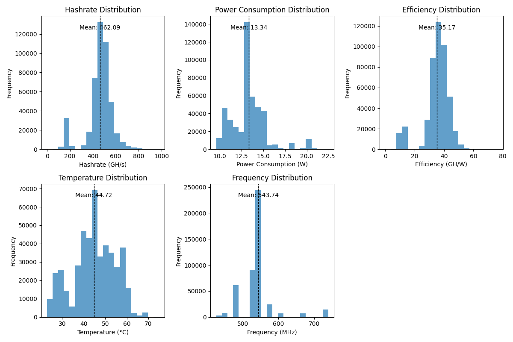

This work shall highlight the potential and usability of a benchmarking framework for Bitcoin ASIC chips.
This is been used on BM1366 chips.

General Data recorded about the benchmarking tool can be found in the `monitoring` folder. You need to setup the docker container in order to gain them. Credentials can be found in there aswell.

Over a periode of multiple weeks data of [Bitaxe](https://github.com/skot/bitaxe) can be found in the `csv`files. Which have been aggregated using the analyse-data.py.
In order to analyse the data it needs to be extracted out of the influxdb using the export-data file.
